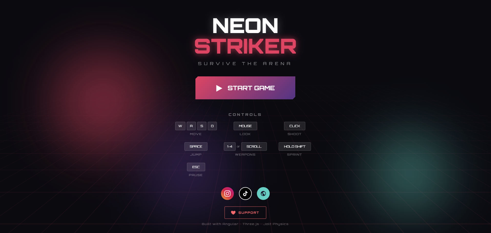
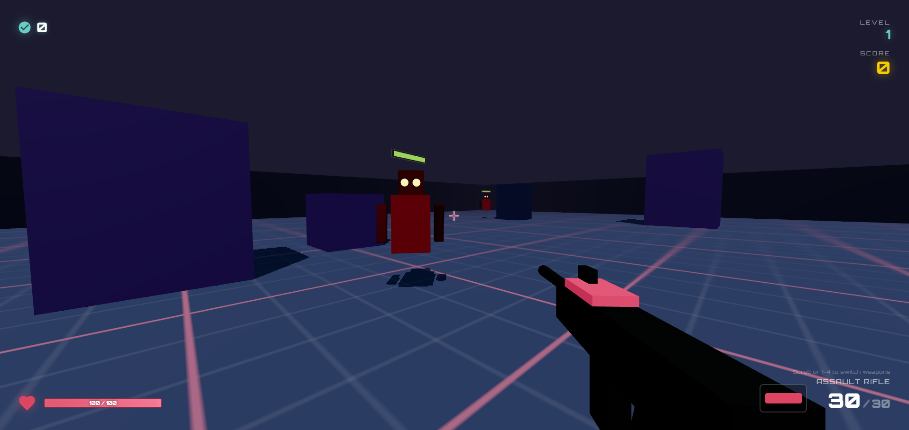

# 🎮 Neon Striker - FPS Mini Game

A fast-paced first-person shooter built with **Angular**, **Three.js**, and **Jolt Physics**.




## ✨ Features

### 🔫 Weapons (4 types)
- **Plasma Pistol** - Semi-auto starter (12 rounds)
- **Assault Rifle** - Full-auto rapid fire (30 rounds)
- **Scatter Gun** - 8-pellet spread shot (6 shells)
- **Rail Gun** - High-damage sniper (5 rounds)

### 👾 Enemies (4 types)
- **Basic Robot** - Balanced stats
- **Scout** - Fast, low health
- **Tank** - Slow, heavily armored
- **Drone** - Flying aerial enemy

### 💊 Power-ups
Health, Ammo, Speed Boost, Shield, Weapon Pickups

### 🎵 Sound Effects
Procedurally generated weapon sounds, impacts, pickups

### 📱 Mobile Support
Touch controls with dual virtual joysticks

### 🌆 Level Themes
Neon, Industrial, Cyber - with progressive difficulty

## 🎮 Controls

### Desktop
| Action | Key |
|--------|-----|
| Move | W / A / S / D |
| Look | Mouse |
| Shoot | Left Click |
| Jump | Space |
| Sprint | Shift |
| Reload | R |
| Switch Weapon | 1-4 or Scroll |
| Pause | Escape |

### Mobile
- Left Joystick - Move
- Right Joystick - Look
- FIRE/JUMP buttons

## 🚀 Quick Start

```bash
cd neon-striker
npm install
npm start
```

Open http://localhost:4200

## 🏗️ Tech Stack

- **Angular 21** - Frontend framework
- **Three.js** - 3D graphics
- **Jolt Physics** - WASM physics engine
- **Web Audio API** - Procedural sound

## 📁 Project Structure

```
src/app/
├── services/
│   ├── physics.service.ts    # Jolt Physics
│   ├── renderer.service.ts   # Three.js
│   ├── game.service.ts       # Game loop
│   ├── weapon.service.ts     # Weapons
│   ├── enemy.service.ts      # Enemy AI
│   ├── powerup.service.ts    # Power-ups
│   └── sound.service.ts      # Audio
├── game/                     # Game UI
└── menu/                     # Main menu
```

## 🎯 Gameplay

1. Spawn in arena center
2. Enemies attack from edges
3. Shoot to earn points
4. Collect power-ups
5. Every 15 kills = level up

## 🔗 Links

- [Instagram](https://instagram.com/moe_as7/)
- [TikTok](https://tiktok.com/@moe_as7)
- [Portfolio](https://mohamad-abou-salem.web.app/)
- [Support/Donate](https://buymeacoffee.com/mohamadabousalem)

## 📝 License

MIT
